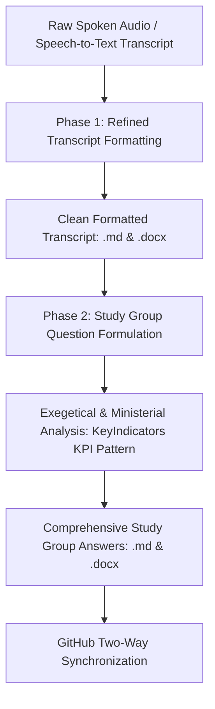

# Study Group Workflow & Standard Operating Procedure (SOP)
## *The Definitive System for Transcript Formatting, Exegetical Answering, and Word (.docx) Compilation*

---

## 1. Executive Architecture

This manual establishes the universal, repeatable workflow for processing ministry audio transcripts, compiling polished study documents, and generating rigorous Study Group examination answers within the Saints Community Church / Theos ecosystem.

The system operates across **two distinct, sequential phases**:



1. **Phase 1: Raw Transcript Formatting (The Refined Claude Standard)** — Transforming verbose, repetitive oral transcription into structured, publication-grade expository reading material while preserving 100% of the speaker's theological vocabulary and doctrine.
2. **Phase 2: Study Group Question Answering (The KeyIndicators KPI Standard)** — Synthesizing the teaching into exhaustive, multi-tiered theological answers that seamlessly integrate Greek/Hebrew word mechanics, scriptural cross-references, and direct pastoral/cell leadership application.

---

## 2. Phase 1: Raw Transcript Formatting Protocol

### The Four Non-Negotiable Pillars

| Pillar | Requirement | Implementation Rule |
| :--- | :--- | :--- |
| **1. Theological Fidelity** | 100% Preservation | Never modernize, replace, or dilute technical terms (*pais*, *huios*, *teknon*, *diakonos*, *doulos*, *didasko*, *bazaar*, *shamayim*, *celem*, *badal*). |
| **2. Syntactical Smoothing** | Oral to Expository | Remove vocal fillers ("praise the Lord," "you know," "are you with me," "I didn't say that over and over"). Convert oral run-on sentences into punctuated, grammatically complete paragraphs. |
| **3. Pronoun Harmonization** | Expository Voice | Transform shifting colloquial pronouns ("you know when you go there and we are doing it") into clear third-person or collective expository discourse without altering the speaker's voice. |
| **4. Subheading Taxonomy** | Speaker-Grounded | Subheadings must originate strictly from the speaker's own vocabulary and argumentative turns. Never use generic corporate headings like "Key Takeaways" or "Overview." |

---

### Typography, Geometry & Spacing Specifications

Every generated Microsoft Word (`.docx`) document must adhere to the exact typography and spacing profile below:

```
+-----------------------------------------------------------------------+
|  PAGE GEOMETRY: Standard Letter (8.5" x 11.0" / 12,240 x 15,840 dxa)  |
|  MARGINS: 1.0" (1,440 dxa) Top, Bottom, Left, and Right               |
|  BASE FONT: Arial, 12 pt (24 half-pts), Dark Neutral (#111827)        |
+-----------------------------------------------------------------------+
|                                                                       |
|  [TITLE]        Cell Leaders Conference                               |
|                 Arial 18 pt, Bold, Centered                           |
|                 Space Before: 0 pt | Space After: 2 pt (40 dxa)       |
|                                                                       |
|  [SUBTITLE]     How Leadership Changes You                            |
|                 Arial 14 pt, Bold + Italic, Centered                  |
|                 Space Before: 0 pt | Space After: 10 pt (200 dxa)     |
|                                                                       |
|  [HEADING]      Leadership Is Service: The God Model vs World Model   |
|                 Arial 12 pt, Bold, Left-Aligned                       |
|                 Space Before: 14 pt (280 dxa) | After: 4 pt (80 dxa)  |
|                                                                       |
|  [SCRIPT REF]   Matthew 20:24-28                                      |
|                 Arial 12 pt, Bold + Italic                            |
|                 Space Before: 8 pt (160 dxa) | After: 2 pt (40 dxa)   |
|                                                                       |
|  [SCRIPT VERSE] [24] And when the ten heard it, they were moved...    |
|                 Arial 12 pt, Bold + Italic, Left Indent: 0.25"        |
|                 Space Before: 1 pt (20 dxa) | After: 1 pt (20 dxa)    |
|                                                                       |
|  [BODY TEXT]    The idea some of us have about leadership needs...    |
|                 Arial 12 pt, Line Spacing: 1.15                       |
|                 Space Before: 4 pt (80 dxa) | After: 4 pt (80 dxa)    |
|                 Greek/Hebrew Terms: Bold + Italic (pais, diakonos)    |
|                                                                       |
+-----------------------------------------------------------------------+
```

---

## 3. Phase 2: Study Group Question Answering Engine

The answering methodology follows the proven pattern established in **`KeyIndicators_Track1_Answers.docx`**:

### Architectural Anatomy of an Answer

Every question response must consist of four distinct, rigorous components:

```
[HEADER METADATA]
STUDY GROUP QUESTIONS (Date Range)
Conference / Series Title – Teaching Topic
Name: AGBEDE STEPHEN AYOTOMIWA
CHURCH: SAINTS COMMUNITY CHURCH, AKURE

   ├── QUESTION [N]
   │     └── Exact verbatim question prompt in bold.
   │
   ├── INTRODUCTION
   │     ├── Frame the topic within the local church curriculum and discipleship.
   │     ├── Define what the subject IS and what it is NOT.
   │     ├── Expose the common human/worldly fallacy regarding the topic.
   │     └── Preview the scriptural, lexical, and practical trajectory of the answer.
   │
   ├── BODY (Thematic, Analytical Sections)
   │     ├── Thematic Subheading 1: Foundations & Contrasting Worldviews
   │     ├── Thematic Subheading 2: Exegetical Proof & Pilot Scriptural Anchor
   │     │     ├── Indented verbatim Scripture quotations with verse numbers
   │     │     └── Greek/Hebrew lexical analysis (root words, Septuagint links)
   │     ├── Thematic Subheading 3: Case Studies & Biblical Narratives
   │     └── Thematic Subheading 4: Direct Ministerial & Discipleship Application
   │
   └── CONCLUSION
         ├── Synthesis of the scriptural arguments.
         ├── Direct warning against fleshly shortcuts or quitting.
         └── Actionable pastoral verdict / affirmative confession.
```

---

### Expository Rigor Guidelines

1. **No Superficial Bullet Points**: Every major point must be argued as an essay-grade expository paragraph demonstrating cause-and-effect reasoning.
2. **Exegetical Precision**: Always trace Greek and Hebrew roots where applicable:
   - *Example:* Do not simply say "Jesus was a servant." Demonstrate that in Acts 3:13 and 4:27, Peter utilizes ***pais*** (a servant who is a son / son-servant) connecting directly to the Septuagint of Isaiah 42:1, distinct from ***huios*** (mature son) or ***teknon*** (child).
3. **Double Application Standard**: Every answer must address both **doctrinal understanding** (what the believer knows) and **ministerial execution** (how the cell leader, worker-in-training, or disciple functions in daily ministry).

---

## 4. Master Python Engine (`study_group_engine.py`)

To make this workflow fully repeatable with zero manual layout overhead, the automation engine is maintained directly inside the `Study group/` folder:

### Supported Engine Modes
- **Build Formatted Docx:** Reads structured Markdown and compiles the standardized Letter `.docx` with exact margins, headings, and indents.
- **Generate Study Answers:** Compiles both `.md` and `.docx` versions of the Study Group assignment.
- **Word Counter:** Automatically calculates total word counts and verification metrics.

### Command-Line Execution

```powershell
# Run the complete study group generator and verify word counts
python "c:\Users\Stephycopy\OneDrive\Desktop\Theos\theos\Study group\study_group_engine.py"
```

---

## 5. One-Click Batch Automation (`run_study_group_pipeline.bat`)

Double-clicking `run_study_group_pipeline.bat` executes the entire pipeline end-to-end:
1. Validates Python runtime and dependencies (`python-docx`).
2. Executes `study_group_engine.py` to rebuild formatted files and study answers.
3. Automatically stages, commits, and pushes all changes to the GitHub repository.

---

## 6. Two-Way Git Synchronization Standard

Every modification, update, and newly generated study document must be synchronized to GitHub immediately:

1. Update `CHAT_AND_UPDATES_LOG.md` with:
   - Date & Time
   - Topic / Teaching Title
   - Word count metrics
   - Files modified/added
2. Run `auto_sync_push.bat` or run:
   ```powershell
   git add -A
   git commit -m "Update Study Group: [Topic Name]"
   git push origin main
   ```
3. Verify remote status at [https://github.com/StephSMITH-hub/theos](https://github.com/StephSMITH-hub/theos).
